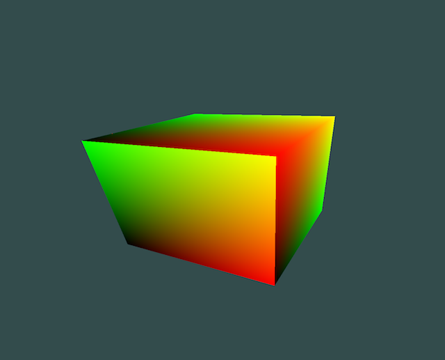
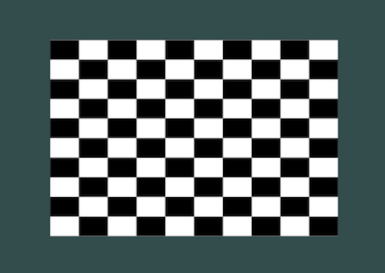
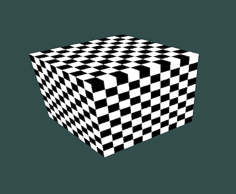
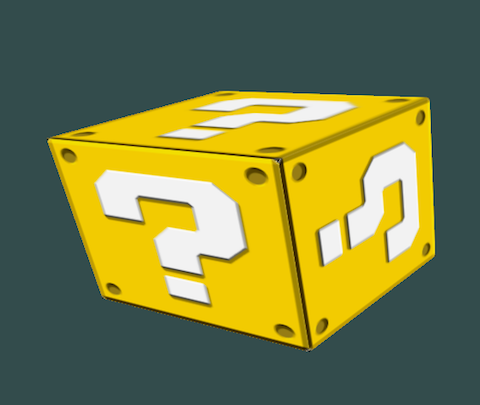
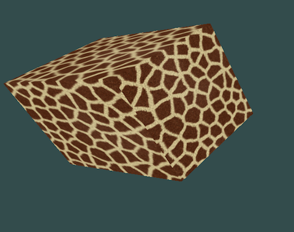
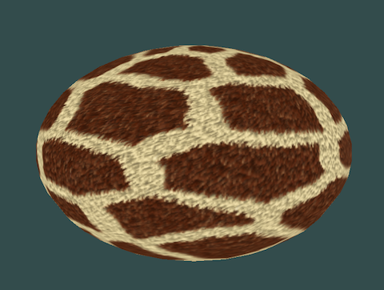

# Lab 7 - Textures

*You may work individually on this assignment.
To receive credit, demonstrate your
completed program during lab or create a tag called `lab07`push your
code (and tag) up to Bitbucket and submit the hash to D2L prior to class on
the due date.*

In this lab, you’ll be exploring the basics of texture mapping. Texture mapping
provides added realism when rendering objects.  Rather than computing all
details of a material, they can be looked up in a texture. A texture can simply
be an image that represents the color of an object, but can also contain other
information such as normal, or specular data.

## Recommended Reading

* [learnopengl.com - textures](https://learnopengl.com/Getting-started/Textures)
* Foundations of Computer Graphics, Chapter 11
* OpenGL Programming Guide, Chapter 6
* [Texture Mapping - Wikipedia](http://en.wikipedia.org/wiki/Texture_mapping)

## Note

In this lab, I have provided a `shape.h` with geometries of a cube and a sphere
to help you get started.  This version of `shape.h` is a little different from
the previous ones to align with some additional notes, but feel free to use
an old `shape.h`, the `shape.h` that is in this folder, or your own as a
starting point.

Also, I do not think that you will need it for this lab, but you are now free to
use GLM.  I have added a version 0.9.9.7 of it to the library.  If you would
like to incorporate the GLM library, please use the version that I have
supplied, (do not add another one to your repository).

## Part 1 - Texture coordinates

Texture coordinates are used to look up the information contained within a
texture.  Each vertex in your geometry requires a texture coordinate. A texture
coordinate is a 2 element vector, which has components that range from 0 to 1.
Choose coordinates for each vertex so that our texture image is mapped to each
face. The x component of your texture coordinate maps from the left side (0) of
the image to right (1), and the y components maps from the bottom (0) to the top
(1). Create an array of uv coordinates that correspond to each of the cube’s
vertices, upload them to a buffer and bind them to a uv variable in your vertex
and fragment shaders. This is very similar to what you did for normals in lab 5.
Before moving on, make sure your cube has uv coordinates by binding the x and y
components of your uv coordinate to the red and green components of your output
color in your fragment shader (i.e something like

    fragColor = vec4(uv.x, uv.y, 0, 1);

Each face of your cube should have a black corner (0,0), a red corner (1,0), a
green corner (0,1) and a yellow corner (1,1).  For example

## Part 2 - Using textures

First, we need some texture data so let's create a checkerboard texture. For
example.

### a. Create texture variables

We will create the texture image as a 1D array.  Each element of the array will
store one pixel for the texture.  In `createTexture`, define two const
variables, `WIDTH` and `HEIGHT`, for the size of our texture.  Next, create a
one dimensional array of GLuints that is large enough to store all the pixel
data for the image.

### b. Generate texture data

Fill your texture array with data using a nested loops, one over the rows and
one over the columns of each pixel. Each row of pixels is packed end to end in a
one dimensional array, so to access any pixel, given a row and column, you can
use the equation, `row * WIDTH + col`. We'll be packing the red, green, blue and
alpha channels of a color into a single 32-bit unsigned integer. (OpenGL can
accept a few different formats, but we'll stick with this one for the lab, and
we'll get to where we tell OpenGL this in the next step). For now, you can use
`0xFFFFFFFF` for white and `0x00000000` for black (every 2 hex values represents
one of the color channels, so `0xFF000000` is full red and 0 for every other
channel and `0x00FF0000` is full green and 0 for every other channel, etc., that
is 8-bits for each channel).

In picture above the texture image that I generated was 250x250 and each cell of
the checker board is 25x25.

### c. Upload texture data to OpenGL

Next, you will need to crate an OpenGL texture object.  Create the texture
object using `glGenTextures`, similar to other OpenGL objects (i.e.
`glGenBuffers`, `glGenVertexArrays`, etc.).

Bind your texture object using

    glBindTexture(GL_TEXTURE_2D, {texture object variable}).

Then upload data to it using glTexImage2D. The parameters in order are:

* target (GL_TEXTURE_2D) - There are different kinds of textures, such as cube
  maps, but we're just doing a basic 2D texture.
* mip map level (0) - Level 0 is the base image.
* internal format (GL_RGBA) - Our texture data contains red, green, blue and
  alpha data.
* width (your width variable) - The number of pixels wide your texture is.
* height (your height variable) - The number of pixel tall your texture is.
* border (0) - Must be 0. This is probably left over from an older version
  OpenGL that is no longer used.
* format (GL_RGBA) - Should match internal format.
* type (GL_UNSIGNED_INT_8_8_8_8) - This is what tells OpenGL that our color data
  is made up of 8 bits for red, green, blue and alpha all packed into an
  unsigned integer.
* data (your GLuint array variable) - This is the pointer your texture data.

### d. Set texture sampling behaviors

You must tell OpenGL how it should behave when sampling your texture. The
default behavior involves interpolating between neighboring mipmap levels, and
since we haven't uploaded any mipmap levels, we don't want that to happen. Use
glTexParameteri to set the behavior to choose the nearest pixel:

    glTexParameteri(GL_TEXTURE_2D, GL_TEXTURE_MIN_FILTER, GL_NEAREST);
    glTexParameteri(GL_TEXTURE_2D, GL_TEXTURE_MAG_FILTER, GL_NEAREST);

Other parameters can be set using glTexParameteri, as well, such as how to
sample the texture if the uv coordinates are outside the 0-1 range.  The default
is to repeat the texture, but we could instead clamp it to the color at the edge
of the texture, for example:

    glTexParameteri(GL_TEXTURE_2D, GL_TEXTURE_WRAP_S, GL_CLAMP_TO_EDGE);
    glTexParameteri(GL_TEXTURE_2D, GL_TEXTURE_WRAP_T, GL_CLAMP_TO_EDGE);

### e. Modify fragment shader

Add a uniform sampler2D variable to your fragment shader. By default, the
sampler2D variable will be set to 0, which indicates to OpenGL to use
`GL_TEXTURE0`. All our texture operations above were performed on `GL_TEXTURE0`,
as it is the default active texture. If you want to use multiple textures you
can change the active texture using `glActiveTexture` and `glUniform1i` to
change a given sampler2D uniform variable to a different texture. Since we're
only using a single texture, you don't need to worry about any of that. Once you
have a uniform sampler2D variable defined in your fragment shader, you can
sample it using the texture function, for example

    vec4 color = texture({sampler2D variable}, {uv coordinate}))

Set the output color of your fragment shader to the sampled color to map the
texture image to each face of the cube.

### f. You have created a texture mapped object

If all goes well, you will now see your box with a surface that is a
checkerboard.

## Part 3 - Loading an image into a texture

Loading images into a program can be a daunting task given how many different
compression techniques and formats there are.  STBImage (which can be found
along with other awesome single file libraries at
[https://github.com/nothings/stb](https://github.com/nothings/stb)
makes the task of loading images a little easier.

The function `loadTexture` can help get you started.  The interface takes a
string to a file and an optional boolean argument to flip the image vertically
on load.  Once you load the image, using it to generate a texture is pretty much
the same as before with a few small changes.

Again, we upload data using glTexImage2D.  The difference is that we get the
values for the `format`, `height`, and `width` from the output for `stbi_load`
and the switch statement on `nrComponents`.

Next we will generate a mipmap, this will help improve the interpolation of the
image.

        glGenerateMipmap(GL_TEXTURE_2D);

Finally, as before we will set the wrapping behavior

        glTexParameteri(GL_TEXTURE_2D, GL_TEXTURE_WRAP_S, GL_REPEAT);
        glTexParameteri(GL_TEXTURE_2D, GL_TEXTURE_WRAP_T, GL_REPEAT);

And the interpolation behavior.  Notice that here we use the mipmap.

        glTexParameteri(GL_TEXTURE_2D, GL_TEXTURE_MIN_FILTER, GL_LINEAR_MIPMAP_LINEAR);
        glTexParameteri(GL_TEXTURE_2D, GL_TEXTURE_MAG_FILTER, GL_LINEAR);

I provided a few images to try out to make a block from an awesome old video
game and a fuzzy giraffe, but feel free to try out your own images.
The site [My Free Textures](http://www.myfreetextures.com/) is a great source.

## Part 4 - Mapping to a sphere

Next we will see how map a texture onto a sphere. In class we saw a derivation
for the sphere.  For another derivation, see [Donald H. House's lecture
notes](https://people.cs.clemson.edu/~dhouse/courses/405/notes/texture-maps.pdf)
Add texture coordinates to the sphere, (either one that you have already created
or the one started for you in `shape.h`.  Now you should be able to mix and
match texture on the sphere.  For example

# Part 5 - Multiple textures

Note that you can load multiple textures with `glActiveTexture` for example:

    glActiveTexture(GL_TEXTURE0);
    GLuint textureQuestion = loadTexture("../img/question.png");
    glBindTexture(GL_TEXTURE_2D, textureQuestion);

    glActiveTexture(GL_TEXTURE1);
    GLuint textureChecker = createTexture();
    glBindTexture(GL_TEXTURE_2D, textureChecker);

And then we need to make sure to set the correct sampler for the shader.  For
example, if we defined the sampler as a uniform named `ourTexture` and since the
question mark texture is in `GL_TEXTURE0` we can use the question mark texture
with
        Uniform::set(shader.id(), "ourTexture", 0);
to get

and since the checker textuer is in `GL_TEXTURE1` we can use the checker texture
with
        Uniform::set(shader.id(), "ourTexture", 1);

## Part 6 - Demo

Create a demo to showcase your work.  There are 4 modes that we can create from
this lab:

- sphere texture mapped with checker board
- sphere texture mapped with image (e.g. the question mark)
- cube texture mapped with checker board
- cube texture mapped with image (e.g. the question mark)

Use the space bar to move through at least two modes modes for the same shape.
For example,

- sphere texture mapped with checker board
- sphere texture mapped with fuzzy giraffe

You can also add additional modes, for example toggling to a second shape, but
providing two screen shots is fine as well.

## Things to notice

Try scaling multiplying your uv coordinates by 2. Notice how the faces of the
cube change. The glTexParameter calls determine how your texture is sampled.  In
this case, we’ve set the wrap behavior of our texture to GL_CLAMP_TO_EDGE.
Because we scaled our texture up by 2, a portion of the face is clamped to the
color at the edge of our texture. Other settings can tell OpenGL to repeat the
texture pattern or to mirror it.

We’ve also set how OpenGL should select a color when the number of pixels in the
texture don’t match up exactly with the pixels on the face of the cube.  We’ve
told OpenGL to just pick the nearest color, we also tell OpenGL to interpolate
the nearest pixels to get a more antialiased look. Experiment with the different
settings you can pass to glTexParameter.

